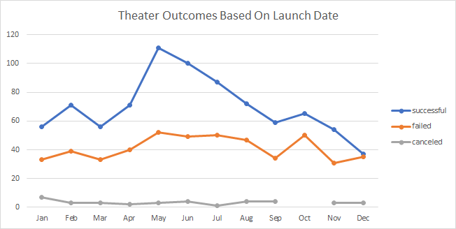
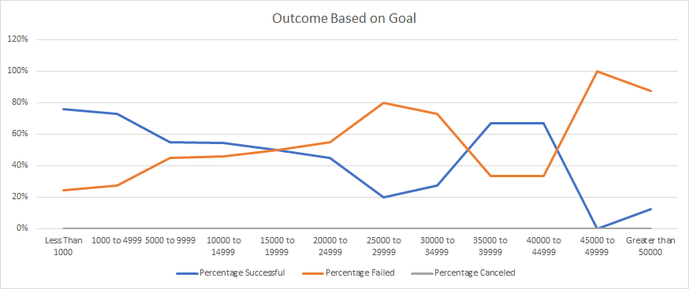

# Kickstarting Analysis
## Overview of Project

- The purpose of this analysis is to uncover trends and insights of different fundraising campaigns from past campaigns that have been closed (either they were successful, failed, or canceled), based on Launch Date of campaigns for Theaters in general, and also based on Goals of campaigns for Plays in specific.

## Analysis and Challenges
- Analysis was performed by first gathering available data from Kickstarter. The dataset was then cleaned by converting timestamps into dates in a Date format recognized by Excel. The Categories as presented on the dataset were not in an ideal format, hence it was split into Parent Category and Subcategory. 

- After the data has been cleaned and standarized, the analysis is then performed on 2 levels. 

### Analysis of Outcomes Based on Launch Date

- The first level is based on Launch Date of campaigns for the parent category of Theaters in general. By pivoting the standardized dataset, a filter is applied on Parent Cateogory to only select Theater, and the pivot table presents the outcomes of all ended campaigns (Successful, Failed, or Canceled) for Theaters by month, regardless of the laucnh year.
</img>

### Analysis of Outcomes Based on Goals
- The second level is based on Goals for the Subcategory of Plays. In a summary table, all campaigns for Plays have been categorized into 12 levels of Goals, from Less than 1,000 to Greater than 50,000. The number of Successful, Failed, and Canceled projects have been extracted from the dataset based on 3 criteria: Subcategory of Plays, Outcomes, and the Goal level. The total number of projects for each Goal level is calculated as a sum of number of Successful, Failed, and Canceled projects at each Goal level, and a percentage of each Outcome at each Goal level is calculated and summarized accordingly. To visualize the trend of Outcomes based on Goal level, the percentage summary is used to generate a graph illustrating the percentage of Successful, Failed, and Canceled projects as the Goal level increases.
</img>

### Challenges and Difficulties Encountered
- One of the challenges of the analysis was the data validation on the Analysis of Outcome Based on Goals. As the summary table is populated with an Excel formula (Countifs) based on multiple criteria, it is easy to make a mistake without knowing it. In order to have confidence that the summary table is populated correctly, a check section on the bottom of the summary table has been created to simplify the formula and extract the total number of successful, failed, and canceled projects for Plays regardless of the goal range. This serves as a confirmation that the totals from the Summary table is matching our expectation.

## Results

- Conclusions from Analysis of Outcomes based on Launch Date: In general, there are more successful campaigns than failed campaigns for Theater fundraising. On average, 61% of the campaigns launched are successful.
Q2 (April to Jun) appears to be the best time of the year to launch a fundraising campaign for Theaters as the percentage of successful campaigns increases and peaks in May at 67%, and slowly declines back to the annual average of 61% in September.

- Conclusions from Analysis of Outcomes based on Goals: 
85% of the fundraising projects were set with a Goal range lower than 10,000. Within this range of projects, 70% of them were successful, whereas the rest of them failed. Different Goal range set for the campaign do result in drastically different outcomes. The goal range associated with the highest success rates are Goals below 5,000 with over 70% of the projects turned out to be successful, followed by goals ranging from 35,000 to 45,000 with a success rate of over 60%. Interestingly, projects with the goal range just below and above this goal range (25,000 to 35,000, and 45,000 to 50,000) had an average fail rate of 80%.

- Limitations of this dataset: This dataset is only showing campaigns that were launched on Kickstarter. Therefore, the insights driven from this analysis do not reflect on campaigns launched on other fundraising websites or methods. In addition, this dataset is only showing campaigns launched up to March 2017, regardless of the categories of projects. Specifically, campaigns for Theaters launched on Kickstarter were mainly launched in 2014 to 2016. The outcomes of these projects are determined by a number of factors that cannot be quantified or illustrated by the analysis performed, and these factors may or may not be applicable in the year of 2020.

- Suggestion of other possible tables and/or graphs that could be created: We can add in an additional pivot table to summary the outcome of campaigns luanched by year, filtering for Theater and Plays. This would show that the percentage of successful campaigns for Plays have been steadily increasing from 61.6% in 2014 to 68.7% in 2016.
Within the Analysis of Outcome based on Goals, we can add in an additional pivot table to summarize the number of campaigns and percentage of successful/failed campaigns, by Country. This would clearly show that vast majority of the campaigns for Plays captured within the dataset were lauunched in the US with a sucess rate of 62% and an average goal of $5,049 for successful projects, followed by Great Britain with a success rate of 77% and an average goal of £2,141 for successful projects.
